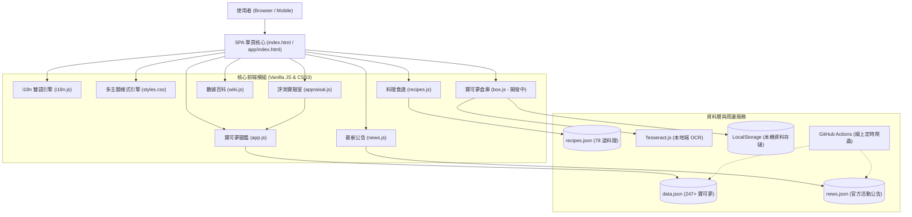

# Pokémon Sleep 資料庫與策略分析工具箱 (pokemon-sleep-app)

<div align="center">

[](https://s102213039.github.io/pokemon-sleep-app/)
[](https://github.com/s102213039/pokemon-sleep-app)
[](https://s102213039.github.io/pokemon-sleep-app/)
[-purple?style=for-the-badge)](https://s102213039.github.io/pokemon-sleep-app/)
[](LICENSE)

**專為《Pokémon Sleep》玩家打造的一站式現代化 Web 應用程式**  
整合官方最新拆包數據、即時雙語切換、食譜能量模擬、數據百科天梯、OCR 截圖辨識入庫、六維雷達評測與 AI 新聞情報分析。

[立即體驗線上版 (Live Demo)](https://s102213039.github.io/pokemon-sleep-app/) | [問題回報 (Issues)](https://github.com/s102213039/pokemon-sleep-app/issues)

</div>

---

## 核心特色功能 (Key Features)

### 1. 寶可夢全圖鑑 (Pokédex & Advanced Dex)
- **完整收錄 247+ 隻寶可夢**：包含神獸（雷公、炎帝、水君、拉帝亞斯、拉帝歐斯、達克萊伊、克雷色利亞、帕路奇亞）與最新特殊型態。
- **多語言 & ID 即時搜尋**：支援中文 (CN)、英文 (EN)、日文 (JP) 與全國圖鑑編號（`#0001`、`1`、`01`），並具備注音與同音字容錯檢索。
- **雙檢視模式**：直觀卡片檢視（Card Grid）與高密度資料表格檢視（Data Table）無縫切換。
- **側邊欄複合篩選**：支援 18 種屬性向量圖示、3 大專長、樹果種類、可產食材、僅初始食材、僅最終進化與主技能篩選。
- **特殊主技能專屬提示**：如「食材精選S」會動態鎖定並顯示該寶可夢專屬的 3 種候選食材池。

---

### 2. 料理食譜計算與模擬器 (Recipes & Pot Simulator)
- **78 道官方食譜全收錄**：涵蓋咖哩/濃湯、沙拉、甜點/飲料三大料理類別。
- **雙向食材篩選器**：
  - **包含食材**：指定料理必須含有的食材（支援「含任一」或「全部符合」）。
  - **排除食材**：隱藏含有特定不需要食材的食譜。
- **即時能量試算引擎**：
  - 食譜等級加成（Lv.1 ~ Lv.70，最高達 +258%）
  - 島嶼營地加成（0% ~ 85%）
  - 活動限定倍率（1.00x ~ 2.50x）
  - 好極了 / 超大成功（2x / 3x）最終能量精算
- **網頁版專屬視覺優化**：預估能量欄位設有 32px 舒適右邊距與放大字體排版，數字清晰易讀。

---

### 3. 數據百科與策略指南 (Wiki & Knowledge Base)
- **主技能數值資料庫**：
  - Lv.1 ~ Lv.8 完整數值一覽。
  - **能量填充S (蓄力)**：0~10 次蓄積動態切換與對照矩陣。
  - **幫手加速 (神獸專屬)**：0~5 種類同屬隊友動態互動試算。
  - **食材精選S 專屬食材池**：6 家族 7 種寶可夢候選食材矩陣。
- **副技能與性格指南**：
  - **主技能發動機率矩陣**：基於官方底層公式精算 24 種組合發動倍率與評級。
  - **副技能階級與數值總覽**：已開放副技能分類與數值。
  - **性格五維屬性倍率表**：官方最新補正增減效果。
- **幫忙速度極限與計算機制指南**：解析全隊幫手獎勵、單體極限速度、35% 副技能上限與性格獨立乘算公式。
- **培育與評級指南**：樹果型、食材型、技能型各專長評級標準與睡眠天數基線計算器。
- **食材產量天梯榜**：
  - 支援六大通用簡化配方形態（XXC, AAX, ABX, ABA, ABB, AAA），簡明易懂。
  - 多維度天梯排序軌道：預設能量升序、能量降序、日產量降序、核心食譜需求量降序。
  - 支援副技能（食材M、幫速M）與性格（食材▲、幫速▲）多重即時試算。
- **樹果與食材基礎能量庫**：樹果能量等級滑桿（Lv.1~70）、島嶼加成（0~85%）、順果 2x 試算與 19 種食材基礎分。

---

### 4. 寶可夢倉庫與智慧 OCR 辨識 (User Box & Smart OCR)

> [!IMPORTANT]
> **開發中階段說明 (In-Progress Notice)**：
> 寶可夢倉庫（User Box）模組目前**尚未進行全面測試與 Debug 調試**。本機端與線上版保留現有之基本介面與儲存邏輯，部分進階操作、極限邊界或跨裝置匯入/匯出在後續版本中將會安排專項 Debug 與穩定性強化。

- **Tesseract.js OCR 截圖辨識**：支援單張與批次上傳/拖曳遊戲截圖，自動辨識寶可夢物種、性格、等級與副技能。
- **智慧防重複入庫**：以「物種 + 性格 + 5副技能」生成專屬指紋雜湊，自動剔除重複辨識項目。
- **手動編輯與備份**：支援自訂暱稱、等級調整 (Lv.1~Lv.80)、食材組合配置與 JSON 備份匯出入。

---

### 5. 評測實驗室與六維量化雷達 (Appraisal Lab & 6D Radar)
- **六維量化戰力指標**：基於 RaenonX PR 算法評測樹果力、食材力、技能力、速度力、自給力、極限爆發力。
- **協同評價與神級組合**：自動分析 BFS 樹果數量S、幫手獎勵、雙食機率與性格契合度。
- **關鍵里程碑培育成本精算**：
  - **Lv. 30**（解鎖第 2 食材）所需專屬糖果、萬能糖果與夢之碎片。
  - **Lv. 50**（解鎖第 3 副技能）所需培育資源。
  - **Lv. 60**（解鎖第 3 食材完全體）所需培育資源。

---

### 6. 最新官方公告與 AI 情報分析 (News & AI Intelligence)
- **AI 重點快報儀表板**：自動提煉活動時間與營地、核心獎勵倍率、特惠禮包清單、機率提升寶可夢與營地出沒清單。
- **橫向甘特圖日程排程 (Gantt Timeline)**：視覺化活動期程與禮包販售區間。
- **乾淨簡約版面**：移除冗餘橫幅，以狀態標籤精確呈現活動與禮包之進行/已結束狀態。
- **全文即時翻譯引擎**：支援中英雙語公告 100% 零遺漏切換。

---

### 7. 行動端專屬介面 (Mobile H5 App)
- 專屬入口網址 `app/index.html`，具備 5 大導航 Dock（圖鑑、食譜、百科、倉庫、消息）。
- 底部抽屜式篩選（Bottom Sheet）、自適應安全區域（Safe Area Insets）與智慧防回彈滾動。

---

### 8. 4 款高對比外觀主題 (Multi-Theme System)
| 主題名稱 | 風格特點 | 適用環境 |
|---|---|---|
| 深邃夜空 (Midnight Navy) | 科技深藍黑 · 霓虹青紫點綴 | 夜間與深色愛好者（預設） |
| 曜石暗影 (Onyx Black) | OLED 純粹黑 · 琥珀流金點綴 | OLED 螢幕極致省電 |
| 晨曦暖陽 (Dawn Amber) | 溫潤奶油白 · 蔚藍高對比點綴 | 明亮日光環境 |
| 萌綠森林 (Emerald Forest) | 清新薄荷白 · 翠綠草木點綴 | 護眼清新日光風格 |

---

### 9. 智能回到頂部導航 (Smart Back to Top Navigation)
- **動態長內容偵測**：當頁面具有充足長度且使用者向下滾動超過閾值（280px）時，自動淡入右下懸浮回到頂部按鈕。
- **平滑滾動與適時隱藏**：點擊後平滑滾動回頁面最頂端，並自動淡出隱藏；再次向下滑動時自動判斷重新展示。
- **雙端適配與行動端避讓**：
  - **桌面版**：右下角舒適懸浮（`right: 28px; bottom: 32px`）。
  - **行動端 (H5 App)**：自適應安全區域（Safe Area Insets），並自動偵測當前頁面之懸浮篩選按鈕（FAB），採垂直堆疊避讓（`bottom: 138px`），杜絕互相覆蓋；無篩選按鈕時平滑落至 Dock 頂部（`bottom: 76px`）。

---

## 系統架構 (System Architecture)



---

## 本地開發與自動化測試 (Testing)

本專案內建一套獨立的 **103 項全自動化測試套件**，涵蓋資料庫完整性、公式精確度、OCR 雜湊去重、i18n 雙語翻譯、雙端路徑跳轉、回到頂部懸浮導航與 UI 元件渲染。

### 執行測試
```bash
# 確保已安裝 Node.js (v18+)
rtk node tests/run_tests.js
```

### 測試覆蓋階層
- **Tier 1 - Feature Coverage (48 項)**：資料集結構、公式計算、食譜加成、主技能矩陣、主題色系、H5 入口完整性、回到頂部按鈕結構。
- **Tier 2 - Boundary Cases (39 項)**：空搜尋、大小寫不敏感、多選交集、等級邊界 (Lv.1~80)、鍋子容量上下限、副技能防重複選擇、回到頂部滾動閾值與避讓邏輯。
- **Tier 3 - Cross-Feature (6 項)**：多維度複合篩選、主題語言聯動切換、Dock 導航持久化。
- **Tier 4 - Real-World Scenarios (10 項)**：完整操作流程模擬、評測六維雷達、食材天梯全排序驗證、雙端共存跳轉防迴圈。

---

## 部署與同步指南 (Deployment)

1. **GitHub Pages 部署**：
   - 專案原生支援 GitHub Pages，只需將分支設為 `main` 或透過 GitHub Actions 自動發布。
2. **資料自動更新**：
   - 在設定彈窗中輸入具有 `workflow` 權限的 GitHub PAT Token，即可一鍵遠端觸發 GitHub Actions 執行最新資料爬取與公告同步。

---

## 版權與免責聲明 (Disclaimer)

- 本專案採用 [MIT License](LICENSE) 開源授權。
- **Pokémon** 及 **Pokémon Sleep** 均為 Nintendo、Creatures Inc. 及 GAME FREAK inc. 之註冊商標。
- 本工具僅供玩家社群交流與遊戲數值研究使用，非官方附屬應用。
